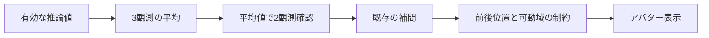

# 腕の奥行きと掌の回転経路

最新訂正（2026-09-12）：下記のStraightHandFrame/80度・40度楕円と上腕肘面回旋は、ユーザーの悪化申告を受け撤去。手首は以前のhandRest基準/60度円錐へ戻した。実記録で前腕角の累積が−609〜799度に達する問題を検出し、無制限の積分をやめて直前表示角から最短の等価角を選び制限する方式へ整理した。肩幅の増幅と推測鎖骨駆動も撤去。比較・限界・再現手順はHANDOFF先頭とresults/control-audit/comparison.jsonを参照。本稿の下記は当時の検討記録であり最新制御の説明とは区別する。

2026-09-12の実装追記：旧60度円錐は、前腕軸へ揃えた中立を中心とする曲げ80度/横曲げ40度の楕円へ変更。これは申告を受けた工学的な試行値で、下記研究から個人の制限値を同定したものではない。前腕±100度と手首の残余ねじり±40度は維持。上腕の肘面追従にも連続角と速度制限を導入し、胴体yawを腰深度から分離。前方腕長解と実Playerの検証結果はHANDOFF先頭に記録。下記の旧制約値は当時の実装記録として読むこと。

実装更新：下記の非重複6フレーム方式は比較用として保持し、現在は重複3平均2点（計4フレーム、毎フレーム更新）が既定。最新の切替・親指制御・肩/前方条件と検証は[HANDOFF](../HANDOFF.md)先頭を参照。本稿の6フレーム評価値はその方式についての記録であり、新方式の値ではない。

関節の可動方向を考慮した駆動は実装できる。ただし、掌の姿勢を最短の回転で結ぶ処理だけでは、人間の腕として通れる経路になるとは限らない。tanakacapでは、前腕の回旋と手首の曲げを分け、前腕角度を連続して追跡してから可動域へ制限する方式を採る。腕の奥行きについても、上腕単独の符号修正ではなく、手首まで含めた制約を適用する。

この文書の根拠は、上肢モデル・回転平均の一次資料と、tanakacapのコードおよび数値検証である。既知の関節構造、今回の実装上の近似、検証で確かめた範囲を分けて記す。現時点の方式は着席した単眼カメラ用の制御であり、人体計測用のモデルではない。

## 関節構造から分けるべき運動

掌と手の甲を入れ替える動きには、前腕の回内・回外が関わる。橈骨と尺骨の相対運動を扱う研究では、この動きを前腕の回旋自由度へ簡略化したモデルも検討されている。これは、アバターの手首だけへ大きなねじりを押しつけず、前腕と手首へ分ける方針を支持する。[^1]

一方、固定した角度上限だけで上肢全体の自然さが保証されるわけではない。姿勢に依存する関節制限を扱った研究は、同じ関節でも他の部位の姿勢によって取り得る範囲が変わること、単眼の2D関節位置からは複数の3D姿勢が成立することを示している。[^2]

今回の実装は、筋力・骨形状・肩甲骨の運動をすべて解くものではない。採用している肘5〜155度、前腕±100度、手首の曲げ60度と残余ねじり40度は、既存アバター駆動用の暫定制限である。これらを一般の人間に共通する厳密な可動域と解釈しない。姿勢別の学習済み制約モデルを今回導入したわけでもない。

## 最短経路と関節制限の違い

179度と−179度は、円周上では2度しか離れていない。ところが、符号付きの数値へ直接上限を適用すると、179度は＋100度、−179度は−100度になる。元の観測は2度しか動いていないのに、前腕の目標値は200度変わってしまう。旧実装の`SignedAngle → Clamp → MoveTowards`には、この不連続が存在した。

角度差には円周を考慮する必要がある。Unityの`Mathf.DeltaAngle`は角度間の短い差を返し、`MoveTowardsAngle`も角度の周回を考慮するAPIである。[^3][^4] ただし、制限付き関節で常に`MoveTowardsAngle`を使えばよい、という意味にはならない。＋100度から−100度への円周上の短い道は、180度付近を通って、許容した区間を外れる。

そこで前腕では、観測角の差だけを短い差として扱い、累積角を作る。

```text
連続角(t) = 連続角(t-1) + DeltaAngle(前回の観測角, 今回の観測角)
目標角(t) = clamp(連続角(t), -100, +100)
```

これにより、179→−179は連続角179→181となり、制限後は100→100となる。許容範囲の端で停止するため、制限の反対側へ遠回りしない。観測が元へ戻れば、連続角も戻り、可動域内で再び追従する。長く止まった場合には、欠測なのか可動域外なのかを区別して調べる必要がある。

この方式は、観測の回転方向が正しいという前提を必要とする。掌の表裏をモデルが突然取り違えた場合や、観測間に正確に180度回った場合には、画像情報だけで方向を一意に決められない。半回転付近では直前の回転方向を使って確認処理の符号を合わせ、完全な半回転の補間も同じ方向履歴を参照する。これは時間的な推定であって、見えていない経路の復元保証ではない。

## 前腕の基準姿勢をどう置くか

回内・回外の「ゼロ度」をアバターの初期ボーン姿勢へそのまま固定すると、腕の向きやアバターの初期の手の向きによって、自然な回転が制限区間の端に偏る。その状態では、角度の不連続だけを直しても十分に動けない。

今回の工学的近似では、肩→肘の上腕方向をa、肘→手首の前腕方向をbとして、−aをbに垂直な面へ投影した方向を基準にする。肘を曲げて手を前に出した姿勢なら、この方向は親指を立てる側の基準として利用できる。アバターの掌の付け根の配置から親指側の方向を作り、前腕の回旋ゼロをこの基準へ合わせる。

この基準は、医学的に測定した前腕軸の代用である。上肢の臨床モデルでは、手首や肘の複数のマーカーを使って回外を求める方法があり、骨軸の定義そのものが計測結果へ影響する。[^5] 現在のカメラ点は肩・肘・手首の中心点であり、同じ情報量を持たない。

肘が伸び切った付近や深く折れた付近では、aとbがほぼ一直線になり、投影方向が不安定になる。この場合は新しい方向を作らず、前の基準方向を前腕の方向変化に合わせて運ぶ。実装の切替値は投影長0.25で、暫定値である。基準面の突然の符号反転も前の方向との連続性で抑える。このため、完全な伸展をまたいだ実動作では、基準方向のずれが残る可能性がある。

手首の補間開始点にも修正を入れた。旧処理は、親である前腕を回した後の手首の世界回転を補間の開始点にしていた。新処理は、そのフレームで腕を解く前の手首の世界回転を保存し、そこから目標へ補間する。親の回転による途中の姿勢を、独立した手の動きとしてもう一度追わないためである。補間後にも手首の可動域を検査する。

## 前にある手首が後ろへ出る原因

旧コードの前方補助には、次の不足があった。

| 場所 | 残っていた問題 | 現在の対処 |
|---|---|---|
| 前方の手掛かり | 肩より下の狭い範囲を中心に評価 | 顔付近まで投影領域を広げ、手の基準点の閾値を他の追跡と合わせる |
| 腕長の学習中 | 支持長が揃うまで前方補助が作動しない | 学習中でも、前方の手掛かりが続けば奥行きの分岐を制約 |
| 上腕の補助後 | 前腕が逆方向を向き、手首が背面へ戻れる | 上腕と前腕の合計奥行きも検査 |
| 時間方向の平滑化 | 古い後方姿勢が補間で戻る | 平滑化後の出力にも制約を適用 |
| アバターのIK | アバターの骨長で解き直すと制約が失われ得る | IKの目標と実際の補間後のボーン位置を確認 |

現在の前方判定は、肩・手首・掌の複数点の信頼度と、画像上の身体付近への重なりを使う。奥行きセンサーや画像の遮蔽順を直接測った結果ではない。手が見えていると判断した範囲で、前後の曖昧さを前方へ解くための着席向け事前条件である。

前腕を後ろへ折り返す動作そのものは禁止しない。例えば上腕の奥行きが＋0.30、前腕が−0.15なら、手首は＋0.15なので許容する。合計が後ろになる場合に、前腕の深度を反射した候補を使い、必要な前方余裕を確保する。XY座標はPython側では変えない。支持長に対して上腕が短く投影される場合は、上腕の前向き条件も併用する。

制約の基準は現在、肩に対するカメラ側のZであり、傾いた胴体の正確な表面や衝突形状ではない。大きな体のひねり、頭の後ろへ手を回す動作、身体同士の遮蔽が複雑な姿勢は、この近似だけでは正しく分離できない。前方制約が働かなかったケースと、前方と誤判定したケースを別々に評価する必要がある。

また、既に表示されていた後方姿勢が新しい制約へ違反する場合は、アバター側で制約を満たす解へ移す。これは平均化の応答より制約を優先する処理なので、切替時に短い位置変化が出ることはある。

## ３フレーム平均を２観測として使う方式

新方式は重複しない区間を使う。1〜3フレームの平均が１観測、4〜6フレームの平均が次の１観測になり、この平均値同士へ従来の方向継続判定を適用する。フレームは推論結果の観測であり、Unityの描画フレームではない。



頭・目・口・胴体・腕・指の値は算術平均を取る。掌の向きは回転行列を平均して正しい回転へ戻す。角度179度と−179度を数値として平均して0度へ向ける事故を避けるためである。回転平均を、回転行列の誤差を小さくする問題として扱う方法は既存研究で検討されている。[^6] 今回は平均行列のSVDから、行列式＋1の回転へ射影する独自の短い実装を用いた。外部ライブラリや古いサンプルコードは追加していない。

初回は比較対象の姿勢がないため、最初に完成した平均で基準を初期化する。それまでは該当部位を有効な新姿勢として送らない。基準確立後に、区間の先頭から新しい姿勢が続いた場合は、６観測目で変化を採用する。区間の途中で動き始めた場合は、その区間に旧姿勢も混じるため、動き始めから常に６観測ちょうどという意味ではない。

欠測で未完成になった掌・指などの平均は持ち越さない。長い観測断でも区間を作り直す。腕長の常時校正は引き続き生の有効観測を使い、5秒・10フレーム・短縮禁止の条件を変えない。前方条件や関節制限は、数値の平均化とは別の制約として残る。

切替はルートの`tracking-settings.json`の`observation_block`で行う。`3`が新方式、`1`が従来の観測単位。デスクトップの同じバッチから起動でき、値の変更後に再起動すると反映される。これは平均化だけの切替で、腕と回転経路の修正は維持する。変更前のソースも`results/checkpoints/before-average3-20260911-231440.zip`へ保存している。

## 検証結果と解釈

Pythonの77テスト、Unityの制約検査とビルド、実Playerのボーン駆動検査に合格した。ここでの合格はソフトウェアの数値条件を満たす意味で、実人物の姿勢を正しく再現したという意味ではない。

### 回転経路

実際のhaolanのボーンを60Hz相当で更新した。−80→＋80→−80度の入力に対し、左の累積回転は316.39度、右316.26度、最大１更新の変化は約2度だった。入力経路の総量320度に近く、余分に一周する経路ではない。差には終点での補間残りが含まれる。

170→190度の制限外入力では、両手とも表示の追加回転が0度となり、制限端で保持された。この結果は180度境界で反対側へ回らないことを確認している。制限外の入力姿勢に完全一致する検証ではない。後方へ向けておいた腕に前方条件を有効にする試験でも、実ボーンの手首・肘のZが負へ戻らないことを確認した。

結果ファイル：`results/unity/transport-1789136733963116900.png.motion.json`。欠測保持と指の既存検証も同じPlayerで合格した。別の平面/前方入力の実ボーン比較では、手首Zの差が0.286となり、奥行き駆動を維持している。結果は`results/unity/arm-depth-1789136780295668300/`。

### 記録済み観測での前後矛盾

`20260911T140701-321003Z-rtmw-l-384`の1596フレームを再処理した。旧出力には、今回の投影上の前方手掛かりに該当しながら手首Zが負だったフレームが左21、右14あった。

新方式で前方制約が有効だった出力は左145、右123フレームで、その中の手首Zが負の出力は両方0だった。現在の制約が自己矛盾を起こしていないことを確認した結果である。旧出力と新出力では判定の確認時間・欠測保持も異なるため、同一母集団の精度改善率とは扱わない。

最大UDPサイズは1717bytesで、受信上限4096bytes以内だった。再処理結果は`results/average1-final-20260911T140701/`と`results/average3-final-20260911T140701/`、比較は`results/motion-revision-report.json`にある。

### 平均化が増やす確認待ち

区間の先頭で段階的に値を変え、90%以上の値が初めて採用されるまでを測った。時間の起点は、最初に変化した推論値が届いた時点である。カメラ露光、画像取得、推論そのもの、Unityの補間、画面表示の時間は含めない。

| 推論観測頻度 | 従来：２観測 | 新方式：３観測平均×２ | 増加 |
|---|---:|---:|---:|
| 30回/秒 | 33.3ms | 166.7ms | 133.4ms |
| 20回/秒 | 50ms | 250ms | 200ms |
| 10回/秒 | 100ms | 500ms | 400ms |

対象記録の推論観測間隔の中央値は49.89msで、約20回/秒に相当する。したがって、新方式は震えを平均する余地が増える一方、遅れを感じやすくなる可能性が高い。瞬きなど短い動きも平均で小さくなる。実使用での震え低減と遅れの比較は未評価なので、新方式を品質向上が確定した設定として固定しない。

## 残る評価課題

回転経路の合成試験では、掌の入力自体が正しいという条件を置いている。実カメラで掌の表裏が反転誤認される問題、親指や小指の付け根が隠れる問題は、この試験に含まれない。取得した掌の基準方向、前腕の連続角、制限適用後の値を並べて調べることが次の切り分けになる。

肘が一直線に近いときの前腕基準、肩を大きく回すときの基準の運び方、腕が身体を横切るときの前方条件は、実人物での評価が必要である。前方の確度をさらに上げるなら、手と胴体の画像上の遮蔽順や追加の画像特徴を使うことが候補になる。計算量だけを増やしても単眼の曖昧さが自動的に消えるわけではない。

## 出典

[^1]: Matthew G. Yough, Russell L. Hardesty, Sergiy Yakovenko, Valeriya Gritsenko. [A segmented forearm model of hand pronation-supination approximates joint moments for real time applications](https://par.nsf.gov/servlets/purl/10278835). IEEE/EMBS NER, 2021, pp.751–754. DOI:10.1109/NER49283.2021.9441405。前腕回旋と簡略化された自由度の根拠。人体への角度上限の直接の根拠には使っていない。
[^2]: Ijaz Akhter, Michael J. Black. [Pose-Conditioned Joint Angle Limits for 3D Human Pose Reconstruction](https://www.cv-foundation.org/openaccess/content_cvpr_2015/papers/Akhter_Pose-Conditioned_Joint_Angle_2015_CVPR_paper.pdf). CVPR, 2015, pp.1446–1455。姿勢依存の制限と単眼の曖昧さの根拠。学習済み制約データは導入していない。
[^3]: Unity Technologies. [Mathf.DeltaAngle, Unity 2022.3](https://docs.unity3d.com/2022.3/Documentation/ScriptReference/Mathf.DeltaAngle.html)。角度の短い差を計算するAPI仕様。
[^4]: Unity Technologies. [Mathf.MoveTowardsAngle, Unity 2022.3](https://docs.unity3d.com/2022.3/Documentation/ScriptReference/Mathf.MoveTowardsAngle.html)。周回を考慮した補間のAPI仕様。
[^5]: [A practical clinical kinematic model for the upper limbs](https://pubmed.ncbi.nlm.nih.gov/29283018/). Journal of Anatomy, 2018, 232(2), pp.207–212。複数の骨指標から前腕回外を計算する計測モデル。今回の中心点のみの推定との情報量の違いを参照。
[^6]: F. Landis Markley, Yang Cheng, John L. Crassidis, Yaakov Oshman. [Averaging Quaternions](https://oshman.technion.ac.il/files/2016/04/Markley_Cheng_Crassidis_Oshman_JGCD_V30_N4_July_Aug_2007.pdf). Journal of Guidance, Control, and Dynamics, 2007, 30(4), pp.1193–1197。回転平均の数学的な根拠。古い依存ライブラリを導入する根拠にはしていない。
